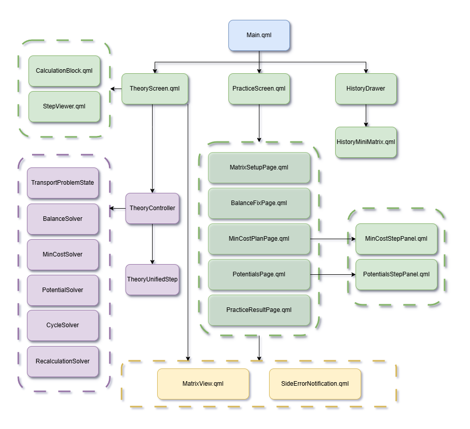

# Transportation Problem Trainer

[]()
[]()
[]()
[]()

Контрольно-обучающее приложение для изучения решения транспортной задачи методом потенциалов.

Проект разработан в рамках выпускной квалификационной работы по направлению **«Прикладная математика и информатика»**.

---

## Назначение проекта

Приложение предназначено для изучения транспортной задачи и метода потенциалов.

Пользователь может:

- получить пошаговую демонстрацию решения;
- увидеть подробные вычисления на каждом этапе;
- самостоятельно решить задачу;
- проверить правильность своих действий;

---

## Возможности

### Режим «Теория»

- автоматическое решение задачи;
- пошаговое отображение алгоритма;
- пояснения к каждому этапу;
- визуализация промежуточных вычислений.

### Режим «Практика»

- самостоятельное решение задачи;
- контроль действий пользователя;
- фиксация ошибок;
- запрет перехода к следующему этапу при ошибке;
- итоговая статистика решения.

### Дополнительно

- генерация случайных задач;
- история решённых задач;
- отображение всех этапов метода потенциалов;
- поддержка задач произвольной размерности.

---

## Архитектура

Приложение разделено на две части:



### Интерфейс (QML)

- `main.qml`
- `TheoryScreen.qml`
- `PracticeScreen.qml`
- `StepViewer.qml`
- `MatrixView.qml`

### Вычислительная логика теоритического модуля (C++)

- `TransportProblemState`
- `BalanceSolver`
- `MinCostSolver`
- `PotentialSolver`
- `CycleSolver`
- `RecalculationSolver`
- `TheoryController`

---

## Реализованные этапы решения

1. Балансировка задачи.
2. Построение опорного плана методом минимального тарифа.
3. Вычисление потенциалов.
4. Проверка оптимальности.
5. Построение цикла пересчёта.
6. Перераспределение перевозок.
7. Получение оптимального плана.

---

## Сборка проекта

### Требования

- Qt 6.5+ (рекомендуется)
- Qt Creator
- Компилятор с поддержкой C++17

### Клонирование репозитория

```bash
git clone https://github.com/SAE-137/Transportation_Problem_Trainer.git
cd Transportation_Problem_Trainer
```

### Сборка в Qt Creator

1. Откройте файл проекта (`CMakeLists.txt` или `.pro`).
2. Выберите установленный комплект Qt.
3. Нажмите **Configure Project**.
4. Выполните сборку (**Ctrl+B**).
5. Запустите приложение (**Ctrl+R**).

---


### Главное окно


### Режим «Теория»


### Режим «Практика»


---

## 📚 Используемые технологии

- C++17
- Qt 6
- Qt Quick
- QML
- Model–View подход
- Рекурсивный DFS для построения цикла пересчёта

---

## Выпускная квалификационная работа

Тема:

> Разработка контрольно-обучающего приложения
> «Решение транспортной задачи методом потенциалов»
> для обучающего комплекса «Оптимизация»
> по дисциплине «Методы оптимизации»

---

## 👤 Автор

Артём Сенченко

GitHub:
https://github.com/SAE-137

---